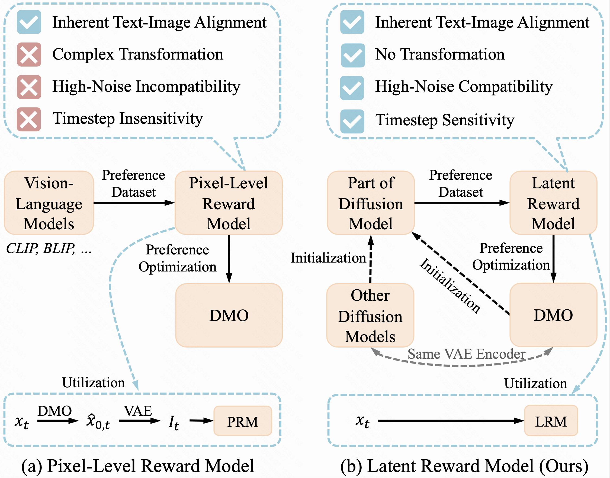

<h1 align="center"> Diffusion Model as a Noise-Aware Latent Reward Model for Step-Level Preference Optimization </h1>

<p align="center">
  <a href='https://arxiv.org/abs/2502.01051'>
  </a> 
  <a href='https://huggingface.co/casiatao/LRM'>
  </a>
  <a href='https://huggingface.co/casiatao/LPO'>
  </a>
  <a href='https://visitor-badge.laobi.icu/badge?page_id=casiatao.LPO'>
  </a> 
</p>

<p align="center">

</p>

## 📝 News
* [2025.05.20]: 🔥 We have uploaded a new version of the paper at [arxiv](https://arxiv.org/abs/2502.01051), which incorporates more experimental results. These include applying LRM to a step-wise variant of GRPO, using LPO on the DiT-based SD3 with Flow Matching methods, and experiments conducted on the HPDv2 dataset. Feel free to check it.
* [2025.05.20]: 🔥 The evaluation code is released!
* [2025.03.20]: 🔥 The pre-trained models are released!
* [2025.03.20]: 🔥 The source code is publicly available in this [repository](https://github.com/Kwai-Kolors/LPO/tree/main)!


## 📖 Introduction
This repository contains the official pytorch implementation of the paper “[Diffusion Model as a Noise-Aware Latent Reward Model for Step-Level Preference Optimization](https://arxiv.org/abs/2502.01051)” paper.

<p align="center">

</p>

In this work, we analyze the challenges when pixel-level reward models are used in step-level preference optimization for diffusion models. Then we propose the Latent Reward Model (LRM) to utilize diffusion models for step-level reward modeling, based on the insights that diffusion models possess text-image alignment abilities and can perceive noisy latent images across different timesteps. We further introduce Latent Preference Optimization (LPO), a method that employs LRM for step-level preference optimization, operating entirely within the latent space.

Extensive experiments demonstrate that LPO significantly improves the image quality of various diffusion models and consistently outperforms existing DPO and SPO methods across the general, aesthetic, and alignment preferences. Moreover, LPO exhibits remarkable training efficiency, achieving a speedup of 10-28&times; over Diffusion-DPO and 2.5-3.5&times; over SPO.

## 🛠️ Usage
Please see the [repository](https://github.com/Kwai-Kolors/LPO/tree/main).

## ⭐ Citation 
If you find this repository helpful, please consider giving it a star ⭐ and citing:
```bibtex
@article{zhang2025diffusion,
  title={Diffusion Model as a Noise-Aware Latent Reward Model for Step-Level Preference Optimization},
  author={Zhang, Tao and Da, Cheng and Ding, Kun and Jin, Kun and Li, Yan and Gao, Tingting and Zhang, Di and Xiang, Shiming and Pan, Chunhong},
  journal={arXiv preprint arXiv:2502.01051},
  year={2025}
}
```


## 🤗 Acknowledgments

This codebase is built upon the [PickScore](https://github.com/yuvalkirstain/PickScore) repository and the [SPO](https://github.com/RockeyCoss/SPO) repository. Thanks for their great work！
