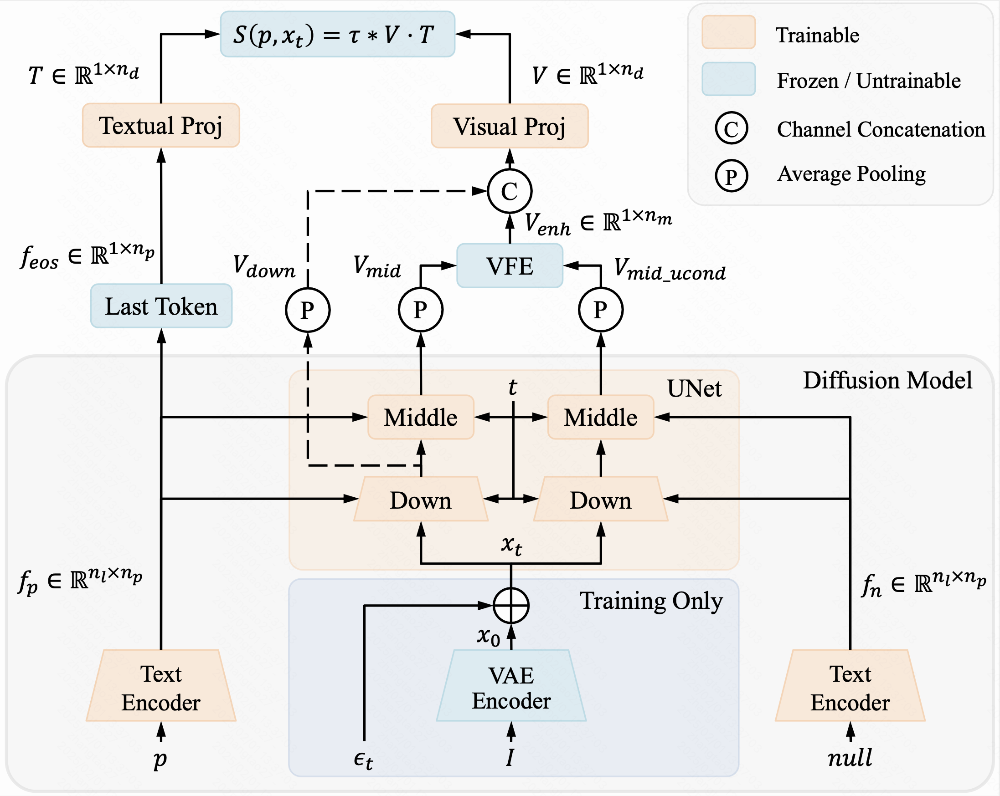
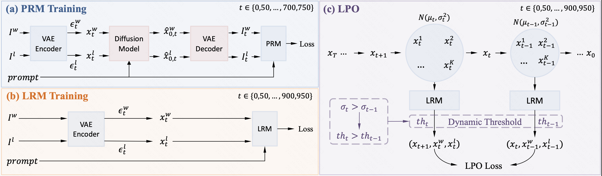
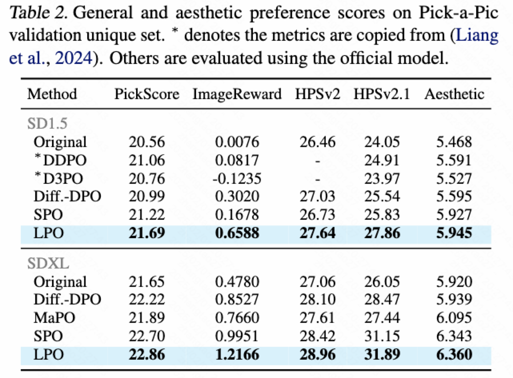
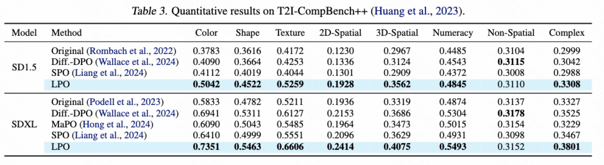
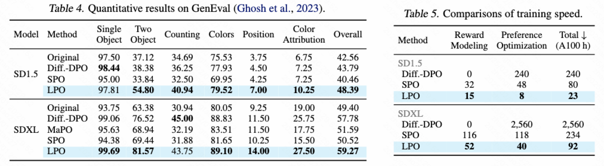

# LPO

This repository contains the official pytorch implementation of the “Diffusion Model as a Noise-Aware Latent Reward Model for Step-Level Preference Optimization” paper.

## 📖 Introduction

In this work, we analyze the challenges when pixel-level reward models are used in step-level preference optimization for diffusion models. Then we propose the Latent Reward Model (LRM) to utilize diffusion models for step-level reward modeling, based on the insights that diffusion models possess text-image alignment abilities and can perceive noisy latent images across different timesteps. We further introduce Latent Preference Optimization (LPO), a method that employs LRM for step-level preference optimization, operating entirely within the latent space.

Extensive experiments demonstrate that LPO significantly improves the image quality of various diffusion models and consistently outperforms existing DPO and SPO methods across the general, aesthetic, and alignment preferences. Moreover, LPO exhibits remarkable training efficiency, achieving a speedup of 10-28$\times$ over Diffusion-DPO and 2.5-3.5$\times$ over SPO.

## 🛠️ Usage

The source code will come soon!